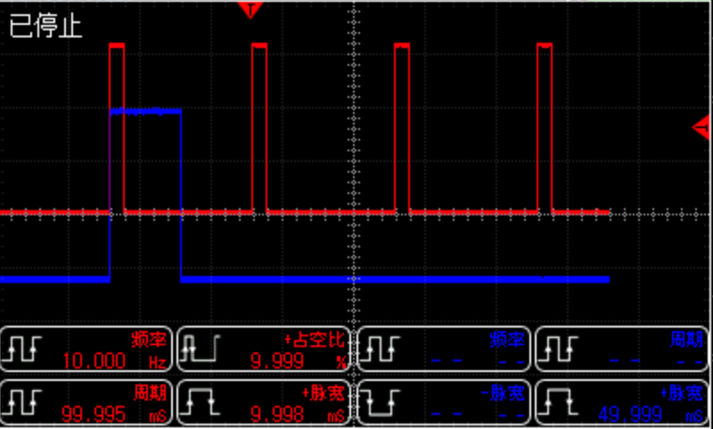

# 同步板软件介绍

本固件系统采用模块化设计，兼顾时间同步精度、低延迟控制与易用性，为多传感器融合系统提供稳定、灵活的软件支撑。整体的功能如下图所示

其中，时间戳的输入来自于上位机或者GPS，然后在本地系统板中进行计时。然后根据不同的需要将系统时间转换为PWM上升沿、PPS时间戳等格式，用于给不同传感器授时。本质上同步板是一个支持不同设备、不同格式的时间分发装置。

## 时间管理功能

同步板内部的系统时间来自于稳定的上位机发送的UTC（协调世界时）时间。为了获取更高的时间同步精度，一个类似PTP的软件同步机制被用于上位机和同步板进行时间戳对齐。

$$
t_{pc} == t_{sys}
$$

另一个时间源来自于GPS，它是不稳定的（室内）并且并不是所有场景下都搭载了GPS设备。因此，GPS的时间戳数据只会被采集并不会被用于整体系统时间，而是实时估计GPS和系统之间的时间差。用户可以自行选择采用所提供的系统时间还是GPS时间，他们的转换关系如下

$$
t_{sys} = t_{gps} + \Delta t
$$

## 同源PWM生成

同源PWM是指具有不同频率但是相同相位的PWM信号，它能够保证外部传感器的触发时间成倍数关系。

例如，相机以10Hz采集，而外部IMU以100Hz采集，同源PWM则可以保证相机采集的时刻刚好对应一帧IMU数据。

同步板将采集PWM的上升沿时刻，并记录反馈给上位机，这样上位机即可精准的获得每一个触发时刻的时间。

## PPS时间戳输出功能

## 通信协议

## 固件烧写流程

## 固件更新日志

